# Tutorial Website E-Meli
## HUT RI Ke-81 - Semarak Kemerdekaan

Panduan Lengkap untuk Pengguna Baru

---

## Daftar Isi

1. [Login ke Website](#1-login-ke-website)
2. [Halaman Utama (Semarak 17 Agustus)](#2-halaman-utama-semarak-17-agustus)
3. [Navigasi Tab](#3-navigasi-tab)
   - [Tab Tirakatan & Uraian Lomba](#31-tab-tirakatan--uraian-lomba)
   - [Tab Database 2025](#32-tab-database-2025)
   - [Tab Tentang (Hall of Fame)](#33-tab-tentang-hall-of-fame)
   - [Tab Game](#34-tab-game)
4. [Countdown & Musik Latar](#4-countdown--musik-latar)
5. [Mode Gelap / Mode Terang](#5-mode-gelap--mode-terang)
6. [Menggunakan Database](#6-menggunakan-database-tabel-data)
7. [Hall of Fame (Galeri Foto & Video)](#7-hall-of-fame-galeri-foto--video)
8. [Masuk ke Dashboard (Admin)](#8-masuk-ke-dashboard-admin)
9. [Pertanyaan Umum (FAQ)](#9-pertanyaan-umum-faq)

---

## 1. Login ke Website

### Langkah 1: Buka Halaman Login

Buka browser (Chrome, Edge, Firefox) dan kunjungi alamat website. Anda akan langsung melihat halaman login.

*Tampilan halaman login saat pertama kali dibuka*

### Langkah 2: Masukkan Username & Password

Isi kolom **Username** dan **Password** dengan akun yang sudah didaftarkan.

*Form login sudah diisi dengan username dan password*

> **Tips:** Tombol **"Tampilkan"** berfungsi untuk melihat password yang sedang diketekan.

### Langkah 3: Klik Tombol Masuk

Setelah mengisi username dan password, klik tombol **"Masuk"**. Jika berhasil, Anda akan diarahkan ke halaman utama Semarak 17 Agustus.

*Setelah login berhasil, Anda langsung masuk ke halaman Semarak*

> ⚠️ **Perhatian:** Jika login gagal, pastikan username dan password sudah benar. Hubungi administrator jika lupa password.

---

## 2. Halaman Utama (Semarak 17 Agustus)

### Langkah 1: Hero Section

Saat pertama masuk, Anda akan melihat bagian utama (hero section) dengan judul besar **"Semarak 17 Agustus"** dan pilihan tombol aksi.

*Tampilan bagian utama halaman Semarak*

> **Info:** Tombol **"Lihat Uraian Lomba"** akan langsung membawa Anda ke bagian daftar lomba.

### Langkah 2: Scroll ke Bawah untuk Countdown

Gulir ke bawah untuk melihat **Countdown Hari Kemerdekaan** yang menampilkan waktu tersisa menuju 17 Agustus.

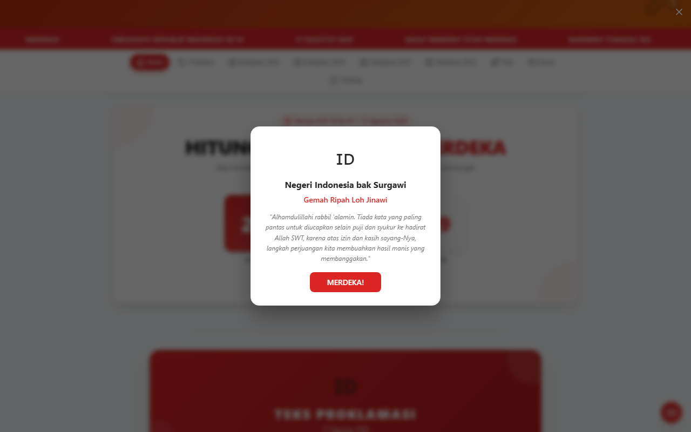
*Hitung mundur menuju Hari Kemerdekaan RI Ke-81*

---

## 3. Navigasi Tab

### Langkah 1: Tab Navigation

Di bagian atas halaman terdapat tombol-tombol tab untuk berpindah antar bagian:

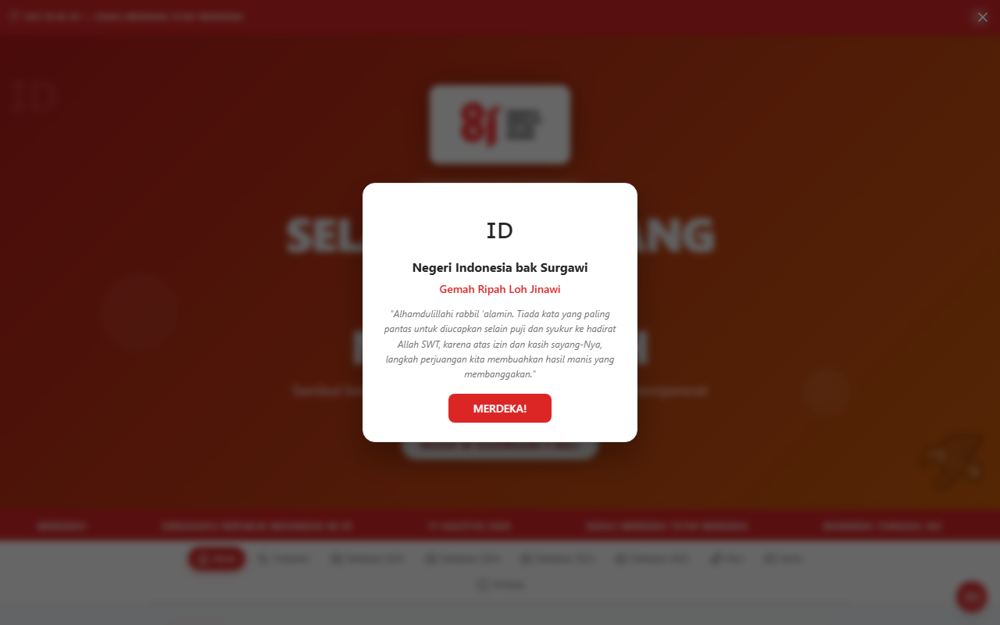
*Tombol tab navigasi di bagian atas halaman*

| Nama Tab | Fungsi |
|----------|--------|
| **Tirakatan** | Uraian lomba dan informasi tirakatan |
| **Database 2025** | Tabel data peserta/pendaftaran |
| **Tentang** | Hall of Fame: galeri foto dan video |
| **Game** | Mini game interaktif |

### 3.1 Tab Tirakatan & Uraian Lomba

Klik tab **"Tirakatan"** untuk melihat daftar uraian lomba yang akan diadakan.

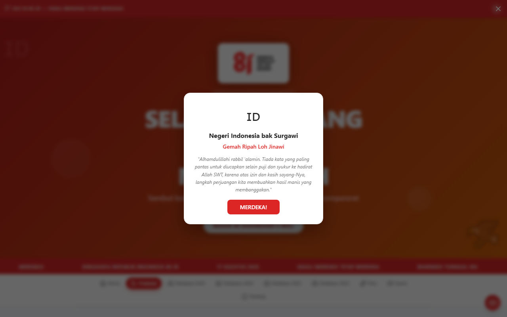
*Tab Tirakatan menampilkan uraian lomba*

> **Tips:** Anda bisa menggulir ke bawah untuk melihat semua jenis lomba yang tersedia.

### 3.2 Tab Database 2025

Klik tab **"Database 2025"** untuk melihat data peserta dalam format tabel.

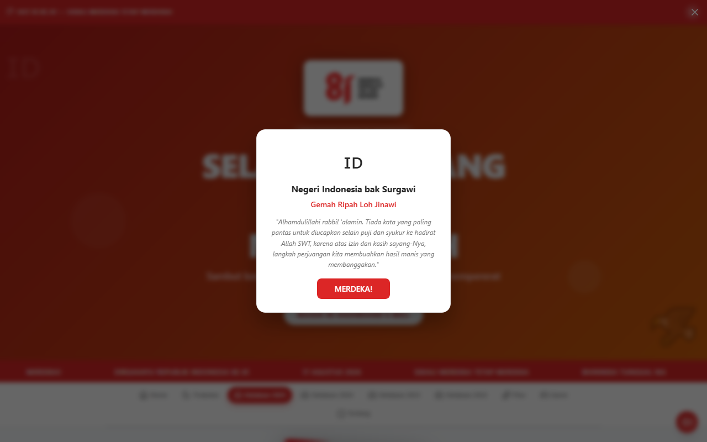
*Tab Database 2025 menampilkan data peserta*

Gulir ke bawah untuk melihat isi tabel data secara lengkap.

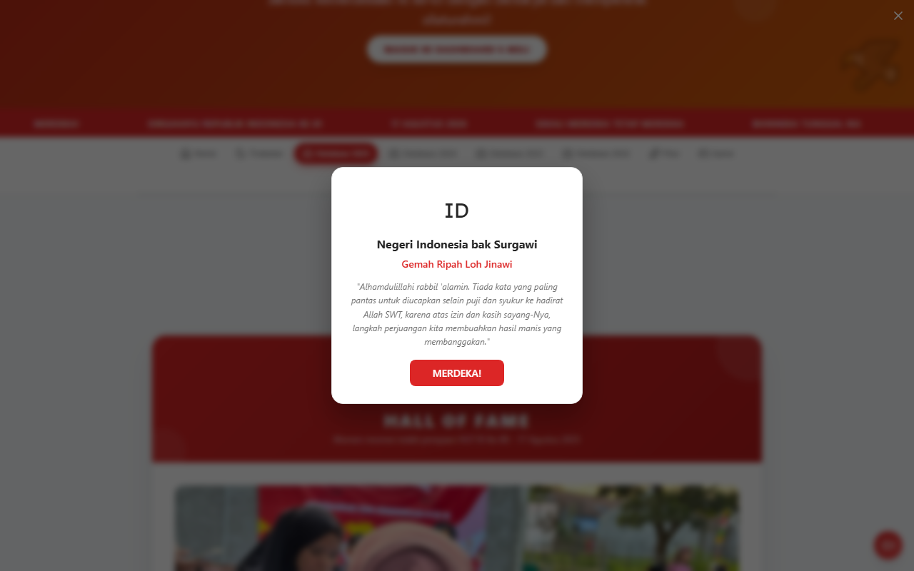
*Tabel data peserta dengan kolom informasi*

### 3.3 Tab Tentang (Hall of Fame)

Klik tab **"Tentang"** untuk melihat Hall of Fame — galeri foto dan video kenangan kegiatan.

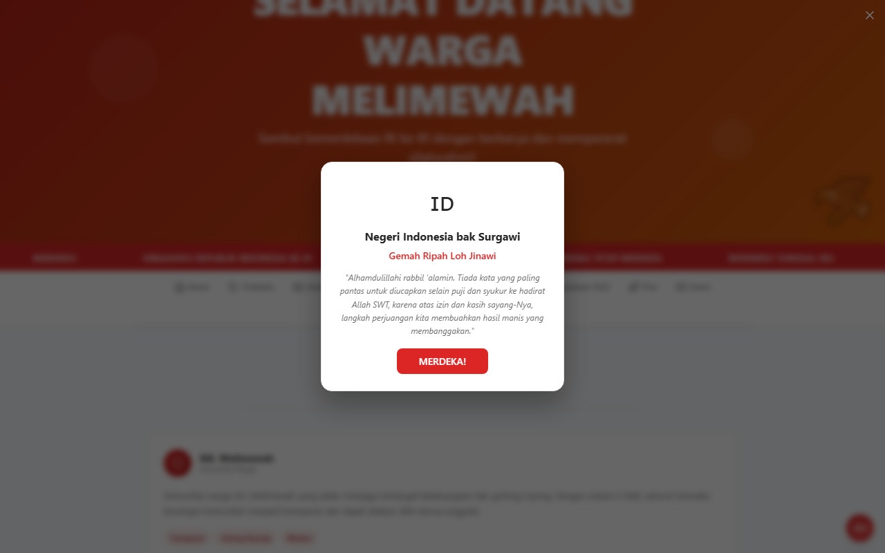
*Tab Tentang menampilkan Hall of Fame*

Gulir ke bawah untuk melihat koleksi foto dalam format grid.

*Galeri foto Hall of Fame dalam tampilan grid*

### Membuka Foto (Lightbox)

Klik pada salah satu foto untuk membuka tampilan layar penuh (lightbox).

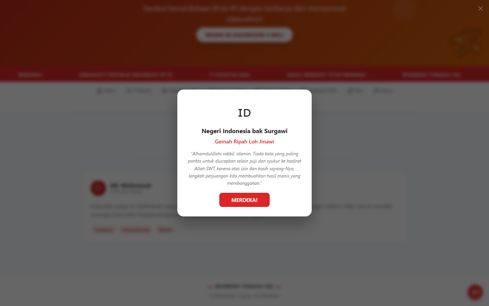
*Tampilan foto dalam mode layar penuh (lightbox)*

> **Tips:** Klik tombol **X** atau tekan tombol **Escape** untuk menutup lightbox.

### 3.4 Tab Game

Klik tab **"Game"** untuk mencoba mini game yang tersedia.

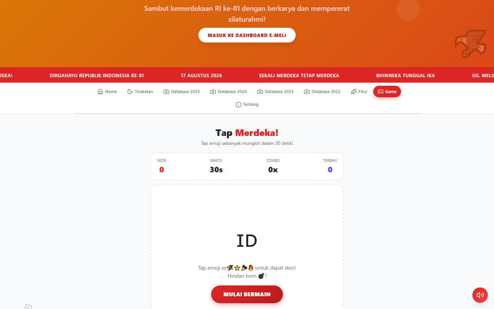
*Tab Game menampilkan mini game interaktif*

Gulir ke bawah untuk melihat detail permainan dan cara bermain.

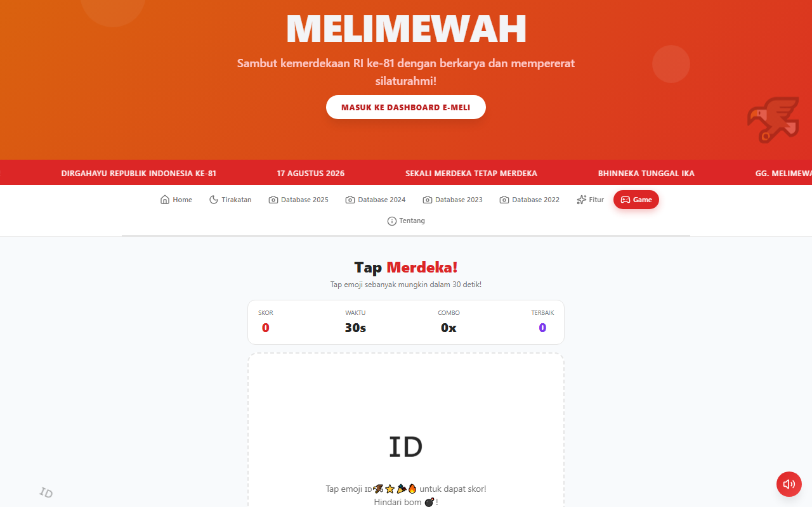
*Detail dan instruksi permainan*

---

## 4. Countdown & Musik Latar

### Langkah 1: Countdown Timer

Di bagian tengah halaman terdapat timer hitung mundur yang menampilkan waktu tersisa dalam format hari, jam, menit, dan detik.

> **Info:** Countdown akan otomatis berhenti di **00:00:00:00** ketika tanggal 17 Agustus tiba.

### Langkah 2: Musik Latar

Di pojok kanan bawah terdapat tombol musik untuk menghidupkan atau mematikan lagu nasional/lagu kemerdekaan sebagai musik latar.

**Cara menggunakan:**
- **Klik tombol musik** untuk memutar lagu
- **Klik lagi** untuk menjeda/mematikan

> **Tips:** Musik akan terus bermain meskipun Anda berpindah tab atau scroll ke bawah. Jika Anda membuka video di Hall of Fame, musik akan berhenti otomatis.

---

## 5. Mode Gelap / Mode Terang

### Langkah 1: Mengubah Mode Tampilan

Di pojok kanan atas terdapat tombol untuk berpindah antara Mode Terang (siang) dan Mode Gelap (malam).

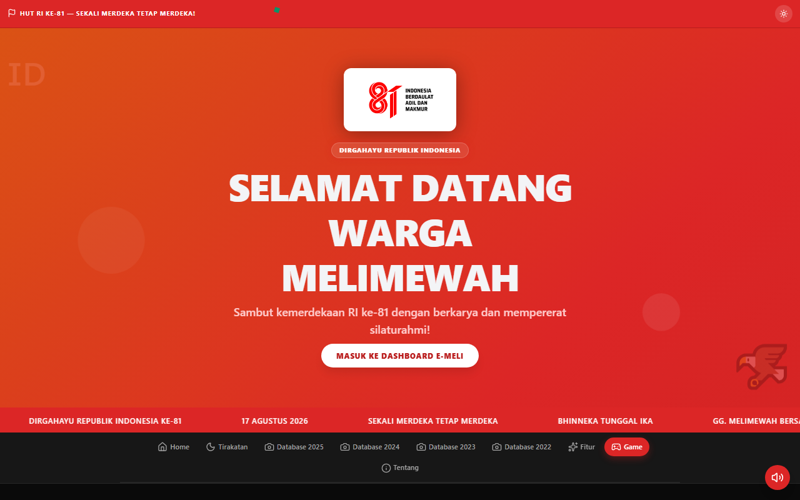
*Tampilan website dalam mode gelap*

> **Info:** Mode gelap membantu mengurangi kelelahan mata saat menggunakan website di malam hari.

---

## 6. Menggunakan Database (Tabel Data)

### Langkah 1: Melihat Data

Data ditampilkan dalam format tabel dengan kolom yang rapi. Untuk melihat data:
1. Buka tab **"Database 2025"**
2. Gulir ke bawah untuk melihat isi tabel
3. Gunakan tombol panah atau scroll bar jika data banyak

### Langkah 2: Mencari Data

Di atas tabel terdapat kolom **pencarian**. Ketik nama atau kata kunci untuk memfilter data secara langsung.

> **Tips:** Pencarian bersifat real-time — data akan langsung terfilter saat Anda mengetik.

### Langkah 3: Mengunduh Data

Jika tersedia, klik tombol **"Download CSV"** atau **"Download Excel"** untuk mengunduh data ke komputer Anda.

> ⚠️ **Perhatian:** File yang diunduh akan tersimpan di folder **Downloads** komputer Anda.

---

## 7. Hall of Fame (Galeri Foto & Video)

### Langkah 1: Melihat Galeri Foto

Tab **"Tentang"** berisi galeri foto kegiatan dalam format grid. Klik pada foto untuk melihat ukuran penuh.

*Koleksi foto dalam tampilan grid*

### Langkah 2: Memutar Video

Di bawah galeri foto, terdapat bagian video yang bisa diputar langsung di browser.

- Klik tombol **Play ▶** untuk memulai video
- Klik **Pause ⏸** untuk menjeda
- Gunakan **Fullscreen ⛶** untuk tampilan layar penuh

> **Tips:** Saat video diputar, musik latar akan berhenti otomatis. Saat video dijeda atau selesai, musik akan kembali berputar.

### Langkah 3: Navigasi Foto (Lightbox)

Setelah membuka foto dalam lightbox, Anda bisa:
- Klik tombol **←** (kiri) untuk foto sebelumnya
- Klik tombol **→** (kanan) untuk foto berikutnya
- Klik tombol **X** atau tekan **Escape** untuk menutup

*Tampilan lightbox dengan tombol navigasi*

---

## 8. Masuk ke Dashboard (Admin)

### Langkah 1: Akses Dashboard

Dari halaman utama, klik tombol **"Masuk ke Dashboard E-Meli"** untuk masuk ke panel admin.

*Tampilan Dashboard admin*

> ⚠️ **Perhatian:** Dashboard hanya bisa diakses oleh admin yang sudah login. Jika tombol tidak muncul, pastikan Anda sudah login dengan akun admin.

### Langkah 2: Fitur Dashboard

Di dashboard, admin dapat:
- Mengelola data peserta dan pendaftaran
- Mengupload foto dan video
- Mengatur informasi lomba
- Mengelola konten website

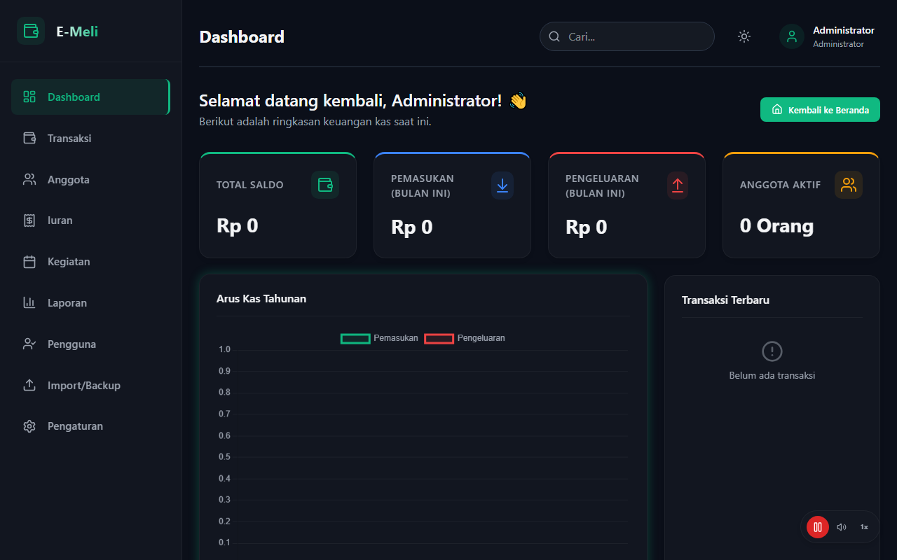
*Detail fitur di dalam Dashboard*

### Langkah 3: Kembali ke Halaman Utama

Klik tombol **"Kembali ke Beranda"** untuk kembali ke halaman Semarak 17 Agustus.

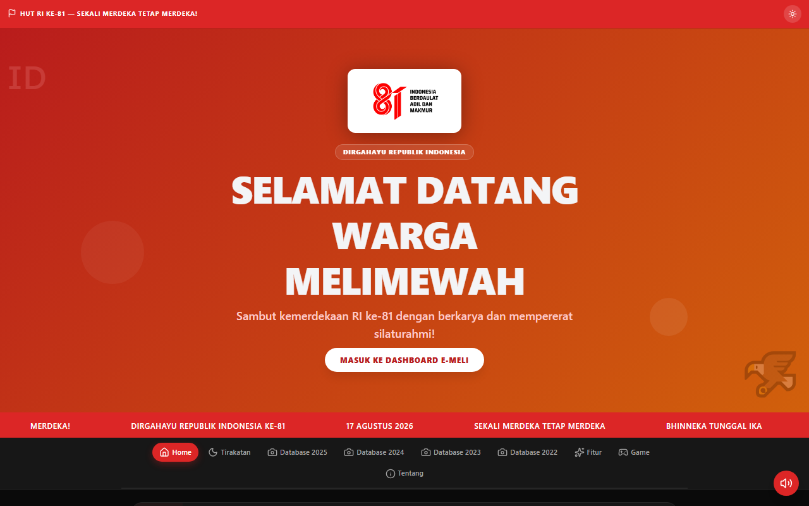
*Tombol "Kembali ke Beranda" di pojok kiri atas dashboard*

---

## 9. Pertanyaan Umum (FAQ)

### Q: Bagaimana cara mengganti password?
Hubungi administrator sistem untuk mengubah password akun Anda.

### Q: Website tidak bisa dibuka?
Pastikan Anda terhubung ke jaringan WiFi yang benar. Jika masih tidak bisa, coba hapus cache browser atau gunakan browser lain.

### Q: Musik tidak berbunyi?
Beberapa browser memblokir autoplay musik. Klik tombol musik di pojok kanan bawah untuk memulai pemutaran.

### Q: Foto tidak bisa dibuka?
Pastikan koneksi internet stabil. Jika foto masih tidak muncul, coba refresh halaman dengan menekan `F5`.

### Q: Countdown tidak muncul?
Countdown hanya muncul sebelum tanggal 17 Agustus. Setelah hari H, countdown akan berhenti di 00:00:00:00.

---

*Tutorial Website E-Meli - HUT RI Ke-81*
*Dibuat untuk memandu pengguna baru*
